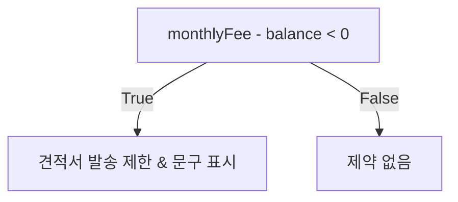

#YWMOBILE

Status
- [ ] Todo
- [x] In Progress
- [ ] Ready For Deployment
- [ ] Done
- [ ] On Hold

File: [문서](https://ywmobileyw-my.sharepoint.com/:p:/r/personal/jyjeung_ywmobile_co_kr/_layouts/15/Doc.aspx?sourcedoc=%7B0B6D7621-33C6-4561-816E-F50451B36A22%7D&file=%EC%B6%A9%EC%A0%84%EA%B8%88.pptx&action=edit&mobileredirect=true&DefaultItemOpen=1&login_hint=joyun%40ywmobile.co.kr&ct=1716946137944&wdOrigin=OFFICECOM-WEB.MAIN.REC&cid=33ea23a8-9eaf-4b2a-a495-6cd775bc92d7&wdPreviousSessionSrc=HarmonyWeb&wdPreviousSession=061937d1-a8c1-41d1-a43d-952b9e619dab)
Created At: 2024-06-25
Start Date: 2024-06-25
End Date: NULL

## Notes
[[2024-06-25 차달 개발팀 회의 (충전금)]]

## TODO
- [x]  충전금 결제
    - 부가세 포함 안된 금액을 입력.
    - 부가세 포함된 금액 결제.
- [x]  %% 포인트가 0원 미만일 때
    - 정비완료 가능해야함.
    - 견적서 작성 막아야함.
    - 경고문구 보여줘야함. %%
    - ![[차달 충전금 경고문구.svg]]
- [x]  %% 25일 이후 + 충전금 50,000원 미만
    - 경고문구 보여줘야함.
        - 문구 정리해서 받을 예정.
        - 문구 보여줘야할 곳.,
	        - [x] 충전금 관리 페이지.
	        - [x] 견적서 작성 페이지.
    - 그 외 제약사항은 없음.  %%
- [x] 전체관리자 충전금 조회 API 수정
	- 현재 전체관리자에서 조회할 때, 금액의 range로 조회 가능. 그러나 전체 조회할 떄 null로 보내면 서버 에러. 서버에서 처리되면 작업해야함. 
	- 전체 조회의 경우 -1로 보내기로함.
	- [x] 내역.
	- [x] 관리.
- [x] 정책 변경으로 문구 수정해야함. 문구 홍프로님이 전달 예정.
	- [관련문서](https://ywmobileyw-my.sharepoint.com/:p:/g/personal/yehong_ywmobile_co_kr/EU4QbJRkM-NNqLYYQnZfoq4Bu_-CgitI-NahXrRnj1sA1g?wdOrigin=TEAMS-MAGLEV.p2p_ns.rwc&wdExp=TEAMS-TREATMENT&wdhostclicktime=1719393155938&web=1)
	- [x] 충전금 충전 페이지.
	- [x] 충전금 관리 페이지.
	- [x] 견적서 발송 페이지.
	- [x] 기타 '원'으로 표시되어 있는 페이지. '원' => 'P'.
- [ ] 충전금 부족시 제약사항에 대한 로직 변경으로 문구 노출 및 견적서 발송 막는 조건 바꿔야함.
	- [관련문서](https://ywmobileyw-my.sharepoint.com/:p:/g/personal/yehong_ywmobile_co_kr/EU4QbJRkM-NNqLYYQnZfoq4Bu_-CgitI-NahXrRnj1sA1g?wdOrigin=TEAMS-MAGLEV.p2p_ns.rwc&wdExp=TEAMS-TREATMENT&wdhostclicktime=1719461260136&web=1)
	- [ ] 충전금 부족시 견적서 발송불가.		
	- [ ] 그동안은 0P 미만시 문구와 50,000P 미만 & 25일 이후일 때의 문구가 달랐음. 이제는 충전금 부족은 모두 통일 + 날짜 조건 삭제.
		- [ ] 충전금 충전 페이지.
		- [ ] 충전금 관리 페이지.
		- [ ] 견적서 발송 페이지.
	- [ ] 매장마다 결제해야하는 충전금이 다름. 따라서 남은 충전금과 결제해야하는 충전금 모두 확인 후 처리해야함.

- [ ] 차달 전화번호 변경.
- [ ] 고객 견적서 주문 페이지: 예약 전에 있는 전화 아이콘 삭제.

## Error
- [x] Server: 충전금이 50,000원 이상인데 견적서 발송이 안됨.
- [x] Server: 전체관리자 충전금 내역/관리 페이지: Range 검색이 부정확함.
	- [x] 다른 건 고쳐졌으나, `/charge/status` 페이지에서 시작과 끝 모두 0으로 검색했을 때 검색이 안됨.
- [x] Client: 전체관리자 충전금 내역/관리 페이지: Range 검색 후 새로고침시 '전체'로 체크되어 있음.
- [ ] 현재 충전금 range로 조회시 음수로 보내면 전체 조회임. 하지만 충전금이 -인 경우도 있으므로 이 로직을 바꿔야할듯함. 

## Test
- [ ] 문구 이상한 거 없는지 확인.
	- [ ] 결제 페이지.
	- [ ] 견적서 작성 페이지.
	- [ ] 충전금 관리 페이지.
- [ ] 카드, 계좌이체 결제 모두 잘 되는지 확인.

## Timetable
- 2024-06-26 14:04 고객 견적서 주문 페이지: 예약 전 매장에게 전화걸 수 있는 아이콘 삭제 요청 들어옴.
- 2024-06-26 17:00 서버 API 전달받음.
- 2024-06-26 17:50 전체관리자 충전금 조회 API 수정.
- 2024-06-27 09:33 Range 검색 새로고침시 '전체'로 체크되어있는 것 수정.
- 2024-06-27 11:01 경고문구, '원' -> 'P' 등 문구 수정 완료.
- 2024-06-27 11:31 충전금 관련 로직 변경. 0원 미만이 아니라 50,000원 미만일 때 견적서 발송을 막음. 문구는 날짜 상관없이 50,000원 미만이면 보여줌.
	- 충전금은 50000P 이상 유지 해야 한다.  
		- 가변으로 해야 한다.  
		- 메장별로 차감 금액이 다를 수 있음.
	- 월말에 사용료에 해당하는 포인트를 차감한다.  
	  - 중간에 가입한 사람은 가입일부터 마일까지 일할계산하여 차감 한다.  
	- 정비완료 버튼 누르는 조건  
	  - 정비완료는 무조건 가능해야 한다. 마이너스 충전금까지 되야 한다.  
	  - 우리가 받아야 하기 때문에  
	- 5만포인트 미만인 경우   
	  - 견적발송이 안된다.
  - 2024-06-27 13:39 서버 금액 range 에러 해결.
  - 2024-06-27 14:30 사용료 API 받음.

## Review
